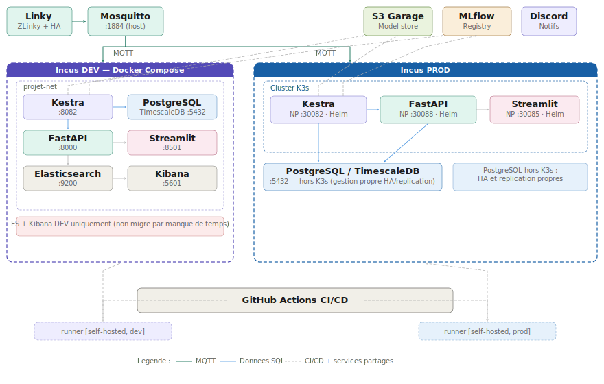
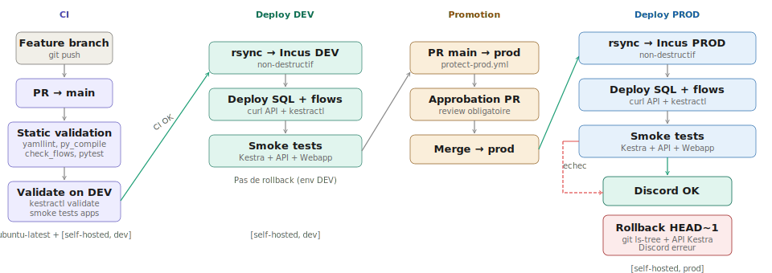

# ⚡ Energy Monitoring — MLOps Pipeline

> Prédiction de consommation électrique personnelle via SARIMA, déployée sur K3s avec CI/CD complète.

**Projet DATA713 — MLOps** · MS IA Expert Data & MLOps · Télécom Paris 2025-2026

EL MOUNTASSER Sara · ELAMINE Mohammed · LAFRANCE Julien · MERNISSI ARIFI Yassine

Encadrants : M. CADAPEAUD Antonin · M. PRILLARD Martin

---

## Contexte

Ce projet construit une boucle MLOps complète autour de données de consommation électrique personnelle : entraînement automatisé d'un modèle SARIMA, détection de drift, serving via API FastAPI, visualisation Streamlit, et CI/CD avec déploiement sur Kubernetes (K3s).

Les données sont collectées en temps réel depuis un compteur Linky et stockées dans PostgreSQL/TimescaleDB selon une architecture Medallion (Bronze → Silver → Gold). L'infrastructure tourne sur deux conteneurs Incus (LXD) — un pour le développement, un pour la production — avec des services partagés (S3 Garage, MLflow) sur le réseau local.

---

## Architecture



Le broker MQTT (Mosquitto) tourne sur le serveur physique et distribue les messages du compteur Linky aux deux environnements. S3 Garage et MLflow sont des services partagés, accessibles depuis les deux Incus. GitHub Actions CI/CD fait le lien entre les deux environnements via des runners self-hosted installés sur chaque conteneur.

L'Incus **DEV** utilise Docker Compose pour le prototypage rapide. L'Incus **PROD** utilise un cluster K3s avec des charts Helm pour la robustesse et le rollback natif Kubernetes. Chaque service K3s est exposé en NodePort.

Elasticsearch et Kibana ne sont déployés qu'en DEV (Docker Compose). La migration vers PROD n'a pas été réalisée par manque de temps — c'est un point d'amélioration identifié.

---

## Choix techniques

| Composant | Choix | Justification |
|-----------|-------|---------------|
| **Orchestrateur** | Kestra | Workflows déclaratifs YAML (pas de code Python pour les DAGs, contrairement à Airflow), support natif des triggers MQTT temps réel (`RealtimeTrigger`), flow triggers pour le chaînage Medallion. Image custom embarquant les dépendances Python pour le Process runner — pas de Docker-in-Docker. |
| **Base de données** | PostgreSQL + TimescaleDB | Extension time-series native : partitionnement automatique en chunks temporels, requêtes d'agrégation optimisées sur fenêtres glissantes. Compatible avec l'écosystème PostgreSQL standard (psycopg2, dbt, pg_dump). |
| **Stockage objet** | S3 Garage (self-hosted) | S3-compatible auto-hébergé, léger, adapté au homelab. Héberge les modèles sérialisés. Pas de dépendance cloud. |
| **Modèle ML** | SARIMA(2,0,0)(2,1,0)[24] | Saisonnalité journalière claire (période 24h), interprétabilité, historique limité (504 points). Un réseau récurrent serait surdimensionné pour ce volume. |
| **Drift detection** | Kolmogorov-Smirnov | Test non-paramétrique comparant deux distributions sans hypothèse sur leur forme. Adapté pour détecter un changement de comportement de consommation. |
| **API** | FastAPI | Typage Pydantic natif, Swagger auto-généré, middleware ES pour monitoring. |
| **Webapp** | Streamlit | Prototypage rapide de dashboards data, intégration Plotly, déploiement simple. |
| **Conteneurisation** | Docker Compose (DEV) / K3s + Helm (PROD) | Docker Compose pour itérer vite en dev. K3s + Helm en prod pour la robustesse, les health checks et le rollback Kubernetes. |
| **CI/CD** | GitHub Actions + runners self-hosted | Les runners sur chaque Incus permettent l'accès direct aux services locaux. Les actions conteneurisées `kestra-io/*` ne fonctionnent pas (localhost pointe vers le conteneur Docker de l'action, pas le host). |
| **Deploy SQL** | API REST Kestra (`curl`) | `kestractl nsfiles upload` a un bug connu. Le script `upload_namespace_sql.sh` utilise directement l'API REST. |
| **Sync filesystem** | rsync sans `--delete` | Non-destructif : les fichiers hors Git ne sont jamais supprimés. |
| **Config centralisée** | `repo_structure.yaml` | Source de vérité unique. Un test pytest vérifie la synchronisation avec les `env:` des workflows. |

---

## Données

```
Linky → ZLinky (Zigbee) → Home Assistant → MQTT → Kestra → PostgreSQL
```

| Couche | Table | Contenu |
|--------|-------|---------|
| Bronze | `raw.linky` | Métriques brutes EAV (1 entrée par message MQTT) |
| Silver | `dbt_silver.linky_energy` | Énergie cumulée par tier tarifaire, dédupliquée |
| Gold | `dbt_gold.linky_hourly` | Consommation horaire en kWh — source pour le ML |

---

## Modèle — SARIMA(2,0,0)(2,1,0)[24]

**Entraînement** (`mlops_train_linky_705.py`) : fenêtre glissante de 21 jours, ré-entraînement hebdomadaire. 5 configurations SARIMA en compétition, sélection par AIC minimal. Split 70/30 pour évaluation test (MAE, RMSE, MAPE). Le modèle final est ré-entraîné sur la série complète. D=1 forcé (domain knowledge).

**Inférence** (`mlops_forecast_linky_705.py`) : toutes les 6h, 72 prédictions horaires avec IC 80%. Chaque run évalue la prévision précédente, détecte le drift (KS test), puis génère la nouvelle prévision.

**Prétraitement** : agrégation des 6 compteurs Tempo, interpolation linéaire (~18% de trous), écrêtage outliers (IQR × 3).

### MLflow

Chaque entraînement et inférence sont tracés (expérience `mlops_linky_sarima_705`). Le meilleur modèle est enregistré dans le Model Registry et exporté sur S3 Garage (`s3://705/mlops/linky-sarima-705/<YYYYMMDDHH>/model.pkl`).

### Data drift

Test de Kolmogorov-Smirnov à chaque inférence (21 derniers jours vs 21 jours précédents). Drift détecté → notification Discord. Résultats dans `gold.mlops_linky_drift`.

---

## API et WebApp

**FastAPI** (`110-api/`) : sert les prévisions depuis `gold.mlops_linky_forecast`. Endpoints : `GET /health`, `GET /forecast/consumption?date=YYYY-MM-DD`. Middleware Elasticsearch pour le monitoring (index `api-logs`).

**Streamlit** (`120-webapp/`) : dashboard prévisions 72h avec graphique Plotly (prédiction + IC), KPIs, tableau détaillé. Appelle l'API via DNS interne Kubernetes (`http://energy-api:8000`).

---

## Flows Kestra

Namespace `projet713`. Secrets dans le KV store (contrat dans `kestra_kv_keys.yaml`).

| Flow | Déclencheur | Rôle |
|------|-------------|------|
| `mqtt_linky_ingest` | MQTT temps réel | Insert Bronze + appel subflow Silver |
| `mqtt_linky_silver` | Subflow (inputs `metric` + `payload`) | Upsert Silver |
| `mqtt_linky_gold` | Cron horaire | Refresh Gold via SQL |
| `mlops_train_forecast` | Cron hebdo (dim 00:00) | Entraînement SARIMA + MLflow + S3 |
| `mlops_linky_forecast_3d` | Cron 6h | Évaluation + drift + forecast 72h |

> Documentation des flows : [`170-docs/flows.md`](170-docs/flows.md)

---

## CI / CD / CT



| Workflow | Déclencheur | Rôle |
|----------|-------------|------|
| `ci.yml` | PR / push `main` | Validation statique + validate sur Kestra DEV |
| `sync-dev.yml` | Après CI réussie | rsync + deploy + smoke tests sur Incus DEV |
| `protect-prod.yml` | PR vers `prod` | Vérifie que la source est `main` |
| `deploy.yml` | Push `prod` | Release atomique sur Incus PROD + rollback auto |

La promotion vers la production passe obligatoirement par une PR `main → prod` approuvée. Le déploiement PROD est une unité atomique : si n'importe quelle étape échoue, le rollback restaure `HEAD~1` via `git ls-tree` + API Kestra.

Le CT (Continuous Training) est assuré par les flows Kestra : ré-entraînement hebdomadaire, inférence toutes les 6h, détection de drift, notifications Discord.

> Documentation complète : [`170-docs/ci_cd.md`](170-docs/ci_cd.md)

---

## Développement local

```bash
git clone https://github.com/julienlafrance/Energy-rte-tempo-forecasting.git
cd Energy-rte-tempo-forecasting
cp .env.example .env  # remplir les valeurs
make install           # dépendances (uv) + pre-commit hooks
make check             # yaml + flows + tests + pre-commit
make test              # pytest seul
make fix               # auto-fix formatting
```

Prérequis : Python ≥ 3.11, [uv](https://docs.astral.sh/uv/).

---

## Monitoring

- **API logs** : indexés dans Elasticsearch (`api-logs`) via middleware FastAPI
- **Kibana** : port 5601 (DEV uniquement) — monitoring requêtes, erreurs, latences
- **MLflow** : port 8050 — performance modèle, drift, versions
- **Discord** : notifications entraînements, forecasts, déploiements

---

## Structure du dépôt

```
.github/workflows/     CI/CD (ci, sync-dev, deploy, protect-prod)
10-flows/prod/         Flows Kestra (5 flows YAML)
50-docker/             Docker Compose (dev) + Dockerfiles
75-infra-prod/         Charts Helm K3s (kestra, energy-api, energy-webapi)
95-ci-cd/              Outils CI/CD (validateur, smoke tests, rollback, config)
100-scripts_mlops/     Scripts ML (train + forecast SARIMA)
110-api/               FastAPI
120-webapp/            Streamlit
130-tests/             Tests (38 tests)
140-sql/queries/       SQL exécuté par Kestra
170-docs/              Documentation (CI/CD, infra, flows)
kestra_kv_keys.yaml    Contrat KV Kestra
Makefile               Commandes dev
pyproject.toml         Dépendances (uv)
```
